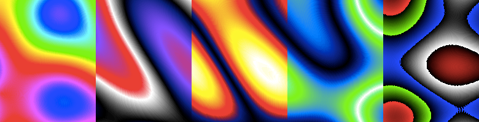

## PlasmaJS

By [Carl Gorringe](http://carl.gorringe.org)

A colorful Plasma demo, written in Javascript, which renders inside an HTML **canvas** tag.

Visit my [demo page](http://carl.gorringe.org/pub/code/javascript/PlasmaJS/) to see it run!

[](http://carl.gorringe.org/pub/code/javascript/PlasmaJS/)




## How To Use


Simply insert a **canvas** tag and the **plasma.js**  file somewhere into your HTML's body like so:

```html
<canvas id="plasma-canvas" width="400" height="400"></canvas>

<script src="plasma.js"></script>
<script>
	var plasma = new PlasmaJS({
		canvasId: 'plasma-canvas',
		palette: 'rainbow'
	});
</script>

```

#### Constructor Parameters

* **canvasId** : Required.
* **palette** : Optional.  Choose from `rainbow`, `nebula`, `fire`, `bluegreen`, or `rgb`.  The default is `rainbow`.
* **timeInterval** : Optional.  Default is 50 milliseconds delay between frames.  Specify a larger number to slow down the animation, or smaller number to speed it up.

#### Methods

For the example above, call `plasma.start()` to begin the animation.

* **.start()** : Start or resume the animation.
* **.stop()** : Stop or pause the animation.
* **.reset()** : Reset to the first frame.
* **.clear()** : Clears the canvas.  Only stays clear until the next frame if currently animating.
* **.fullscreen()** : Set to fullscreen mode.
* **.setPalette( "name" )** : Sets color palette to one of the palettes listed above.  Changes colors right away if currently animating, or will change after resumed.

See examples in **plasma.html**.

## Install using NPM &amp; Browserify

Using this method may be an extra step, but may be worth it if you're already using Node and wish to bundle all of your JavaScript into a single file for faster loading.

First install [Browserify](http://browserify.org) for web support:

```
npm install -g browserify
```
Then install PlasmaJS which is called **plasma-demo**:

```
npm install plasma-demo
```
To use Browserify, place all of your JavaScript code in a separate file, like so:

```javascript
// plasma-test.js
var PlasmaJS = require('plasma-demo');
window.plasma = new PlasmaJS({
	canvasId: 'plasma-canvas',
	palette: 'rainbow'
});
```
Note the use of **window.plasma** above, which will make sure that **plasma** is scoped globally, but which can be named anything.

Now generate your JavaScript bundle:

```
browserify plasma-test.js > plasma-bundle.js
```
Add to your HTML a single script tag to import the bundle:

```html
<script src="plasma-bundle.js"></script>
```


Now you can call methods such as `plasma.start()` to start the lines animation.


## License

Copyright (c) 2018 Carl Gorringe. All rights reserved.

Licensed under the the terms of the [GNU General Public License version 3 (GPLv3)](http://www.gnu.org/licenses/gpl-3.0.html).
